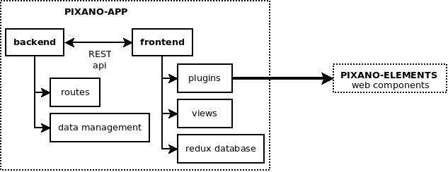

# 

[](LICENSE) [](http://pixano.cea.fr/smart-annotation/) [](Docker)

## What is PIXANO ?
[Pixano](https://pixano.cea.fr/) is a web-based smart-annotation tool for computer vision applications. The modules are driven by artificial intelligence, which assists the human user with annotation tasks and accelerate the annotation process. Try some of our features [online](https://pixano.github.io/demo/demo.html)!

[](https://www.youtube.com/watch?v=z5T2HhnugJo)

Note: this is a GCP-interoperable PIXANO version. It uses Firestore as a database, Google bucket as storage, and Google Authentication as login.
To switch back to the local version, do:
```bash
# replace the line X in frontend/app.js
// this.goLogin();
this.go404();
# replace the headerContent in frontend/src/templates/template-page.js
// return html``
return html`<mwc-icon-button icon="exit_to_app" @click=${() => store.dispatch(logout())} title="Log out"></mwc-icon-button>`
# replace the line X in server/config/db.js
// const db = require('./db-leveldb');
// const storage = require('./storage-filesystem');
const db = require('./db-firestore');
const storage = require('./storage-bucket');
# replace the line X in server/router.js
// const auth = middleware.checkWhoToken;
const auth = middleware.checkWhoGoogle;
# remove the snapshot button in frontend/src/views/app-project-manager.js
<mwc-button @click="${() => snapshotProject()}">Snapshot</mwc-button>
```
In order to bypass cross-origin issues, a temporary fix is to use the following command to open chrome:
```bash
For Linux :
chromium --disable-site-isolation-trials --disable-web-security --user-data-dir="~/tmp"

For Windows :
#1. Open the start menu
#2. Type windows+R or open "Run"
#3. Execute the following command:
chrome.exe --user-data-dir="C://Chrome dev session" --disable-web-security


``` 

Pixano App
===============

## Table of Contents
- [](#)
	- [What is PIXANO ?](#what-is-pixano-)
- [Pixano App](#pixano-app)
	- [Table of Contents](#table-of-contents)
	- [1. Installation](#1-installation)
		- [Using Docker Image](#using-docker-image)
			- [Optional: create an alias](#optional-create-an-alias)
		- [Install from source (for developers)](#install-from-source-for-developers)
			- [Install global dependencies](#install-global-dependencies)
			- [Install application dependencies](#install-application-dependencies)
				- [Using a local pixano-element](#using-a-local-pixano-element)
			- [Build the application](#build-the-application)
			- [Run the application](#run-the-application)
	- [2. Usage](#2-usage)
		- [Configure your first annotation project](#configure-your-first-annotation-project)
		- [Start annotating](#start-annotating)
		- [Export your annotations](#export-your-annotations)
		- [Standalone vs distributed usage](#standalone-vs-distributed-usage)
	- [3. Advanced usage](#3-advanced-usage)
		- [Import predictions](#import-predictions)
		- [Import/Export annotation format](#importexport-annotation-format)
		- [Build docker from sources](#build-docker-from-sources)
	- [4. Contributing](#4-contributing)
		- [Pixano architecture: Pixano-app and Pixano-elements](#pixano-architecture-pixano-app-and-pixano-elements)
		- [Some documentation to get started](#some-documentation-to-get-started)


## 1. Installation

### Using Docker Image

The easiest way to get up-and-running is to install [Docker](https://www.docker.com/). Then, you should be able to download and run the pre-built image using the docker command line tool. Find out more about the `pixano` image on its [Docker Hub](https://hub.docker.com/r/pixano/pixano-app/) page.

Here's the simplest way you can run the Pixano application using docker:

```bash
sudo docker run -it --rm -v "$PWD":/data -p 3000:3000 pixano/pixano-app
```

The path where you run this command must contain the data you want to annotate.

*NB: This path is defined as your workspace.*

#### Optional: create an alias
In practice, we suggest you setup an alias called `pixano` to automatically expose the folder containing your specified image, so the script can read it and store results where you can access them. This is how you can do it in your terminal console on OSX or Linux:

```bash
# Setup the alias. Put this in your .bashrc file so it's available at startup.
# Note that the --network host works only on Linux, use explicit port mapping for Windows and Mac
alias pixano='function ne() { if [ -d "$(pwd)/$1" ]; then DATA="$(pwd)/$1" && shift; else DATA="$(pwd)"; fi; sudo docker run --init -it --rm --network host -v "$DATA":/data pixano/pixano-app $@; }; ne'

# Now run pixano using alias with workspace as argument
pixano ./data-test --port 3001
# or omit workspace and use current directory by default
# pixano
```


### Install from source (for developers)

#### Install global dependencies

- NodeJS (10, 12 or 14)
	To install on ubuntu:

```bash
# Make sure you have curl installed
sudo apt install curl
# Then download and execute the Node.js 10.x installer
curl -sL https://deb.nodesource.com/setup_12.x | sudo -E bash -
# Once the installer is done doing its thing, you will need to install (or upgrade) Node.js
sudo apt install nodejs
# Make sure the version is now correct
nodejs --version
npm install -g npm@6.10.0
```
	You can read this nice [introduction](https://codeburst.io/the-only-nodejs-introduction-youll-ever-need-d969a47ef219) to NodeJS in case you're curious on how it works.
	
> ATTENTION: node version 16 is not compatible for now

#### Install application dependencies

```bash
npm run deps
```

##### Using a local pixano-element
If you want to use custom `pixano-element` modules from local path instead of the NPM registry, link them as explained below:

```bash
# Install application dependencies and local pixano-elements
npm run installLocalElements --path=$PIXANO_ELEMENTS_PATH
```
*NB: Make sure you have the git repository of pixano-elements next to the pixano-app folder and that you have followed the pixano-elements build instructions before running the above commands.*

If this command breaks your local pixano-elements demo, this command will repear it:
```bash
cd $PIXANO_ELEMENTS_PATH
npm run bootstrap
```

#### Build the application

```bash
# Bundle the application using Webpack
# This will create a build folder containing all the sources to be served
npm run build
```

#### Run the application

In the command prompt, type in `node server/server.js` from the root folder and hit enter.

*NB: Make sure you have filled the firestoreConfiguration and bucketName.*


## 2. Usage

After running Pixano-App, you’ll see something similar to this:

```bash
   ┌────────────────────────────────────────────────────────────────────────┐
   │                                                                        │
   │   Serving   /path/to/your/workspace                                    │
   │                                                                        │
   │   - Local:            http://localhost:3000                            │
   │   - On Your Network:  http://xxx.xxx.x.xx:3000                         │
   │                                                                        │
   └────────────────────────────────────────────────────────────────────────┘
```

Open your browser and hit _http://localhost:3000_. You should see the google login page if you are not connected.

### Configure your first annotation project

Before annotating, configure your project by following our [admin's guide](./admin-guide.md). You will be able to:

- define your datasets
- define your desired annotation tasks
- define your users and their role (annotators, validators, administrators)

### Start annotating

Once a task is defined, you (or your annotators) will be able to annotate your dataset. See our [annotator's guide](./annotator-guide.md) for your first steps.  
Our [plugins' guide](./plugins-guide.md) will help you in the use of your current task's specific plugin.

### Export your annotations

Get your annotations and use them for any external application easily:

- as an admin, go to the tasks tab
- press the "EXPORT TO FILES" button
- you will find the exported annotations in the root of your workspace (find more information on annotation format [bellow](#importexport-annotation-format))

### Standalone vs distributed usage

Pixano-app can be used standalone on a single machine. In this case, the "admin" can also directly annotate and validate his datasets. See our [admin's guide](./admin-guide.md) for more details.

Pixano-app is also developed to enable a distributed work:

- install Pixano-app on a server and open its ip and port to your annotators inside your network
- define your datasets, tasks and users (See [admin's guide](./admin-guide.md)). The tasks will be automatically distributed between the annotators.
- each annotator can start working immediately from his computer without installing anything by connecting to _http://xxx.xxx.x.xx:3000_


## 3. Advanced usage

### Import predictions

If you want to analyze predictions from your last detector or use these predictions as a pre-annotation, you can import these predictions as existing annotations by using our [annotation format](#importexport-annotation-format).

### Import/Export annotation format

```
data-test   
│
│───images
│   │    xxx.jpg
│   └─── yyy.jpg
│       
└───annotations
    │─── task1.json
    └─── task1
        │    xxx.json
        └─── yyy.json
```
The `task1.json` file contains global task settings (task type, task categories, image folder, etc) and its corresponding `task1` folder contains an annotation file for each image. To prepare those files check the [import documentation](documentation/import-annotations.md).

### Build docker from sources

To create a docker image of the application, you can use the standard docker command:
```bash
# You can change `pixano` by your choosen image name
sudo docker build -t pixano/pixano-app:my-tag .
```
If you used a local pixano-element, build the application (step 1.b) and then run:
```bash
# You can use the local Dockerfile if the build folder already exists
sudo docker build -t pixano/pixano-app:my-tag -f Dockerfile-local .
```


## 4. Contributing

If you tested Pixano and identified some issues or think some useful features are missing, please open an [issue](https://github.com/pixano/pixano-app/issues).

If you want to edit the application to your liking, fork this repository!

If you want to contribute more actively to the project, feel free to write your patches or new features and make a pull request!

### Pixano architecture: Pixano-app and Pixano-elements



**Pixano-app** is a monorepo built on top of web components dedicated to annotation (developed in a separate repo: [pixano-elements](https://github.com/pixano/pixano-elements)):

- the backend manages the data (datasets to be annotated), the tasks (tasks to be performed by annotators) and the users (annotators, validators, admin)
- the frontend implements the web views and calls the elements through plugins
- backend and frontend communicate via a REST api

[**Pixano-elements**](https://github.com/pixano/pixano-elements) provides a wide set of smart and re-usable web components to build highly customizable image and video annotation tools: 2D and 3D bounding boxes, polygons, segmentation masks, customizable labels, label temporal propagation, etc. **Pixano-app** relies on these web components.

### Some documentation to get started
- General documentation:
	- To get familiar with how the app is built from Web Components, read the [LitElement](https://lit-element.polymer-project.org/) documentation.
	- To get familiar with how the data is managed in the client, read the [redux](https://redux.js.org/introduction/getting-started) documentation.
- Pixano's developers documentation
	- To better understand the Pixano server API, read its [documentation](documentation/rest-api.md)
	- To get familiar with Pixano's elements, take a look at its [dedicated repository](https://github.com/pixano/pixano-elements) and [modules documentation](https://pixano.github.io/docs/)


