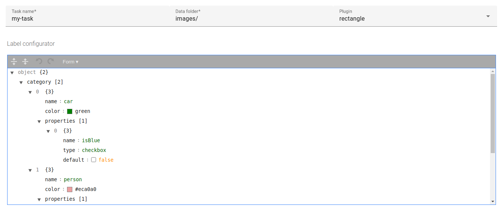

# 

A Guide for Pixano App Configuration and Administration
===============

This guide will help you to configure your annotation project.

## Login page


First authentification is: `username: admin` `password: admin`.

You can then create your annotation project in the [`Tasks` tab](#create-new-tasks) or update your login in the [`Users` tab](#create-new-users).

## Your datasets

Each annotation task refers to a defined dataset. The same dataset can be used for multiple tasks.

A dataset is a folder containing images (directly or inside a hierarchy of folders).

For example, your `data-test` folder could have the following structure:
```
data-test   
│
└───images
    │   xxx.jpg
    │   yyy.jpg
    │
    │   ...
```

#### About data format:

- Make sure your image extensions are either `png` or `jpg`.
- Videos are not directly handled: extract the video frames beforehand. For every plugin taking a sequence as input (e.g. `sequence-rectangle`, `sequence-polygon`, `tracking`, etc), each subfolder containing images will be considered as a sequence.

## Create new tasks
You can fill the task configuration as follows, which will create as many annotation jobs as there are images in your `image` folder:

*NB: Your `data-test` folder refers to the folder containing the images you want to annotate by a relative path to the `workspace` folder.*



**TODO** refaire une image qui reprend l'exemple `data-test` + rajouter les étapes avec bouton ? pour faire un vrai step by step ?

### Definition of a task
A task is defined by :

- `Task name`: the name you want to give to this task
- `Data folder`: the folder containing the data to be annotated in this task (relative path to the `workspace` folder)
- `Plugin`: the plugin/functionnality to be used for this task (choose it from the list). For example, if you want to annotate vehicules by rectangles, choose `rectangle`.
- `Task name`: form...
- `Task name`: model... in the case of a smart plugin, place here the path of the model to be used (the default model...)
**TODO**


## Create new users
- define your users and their role (annotators, validators, administrators)
**TODO**


