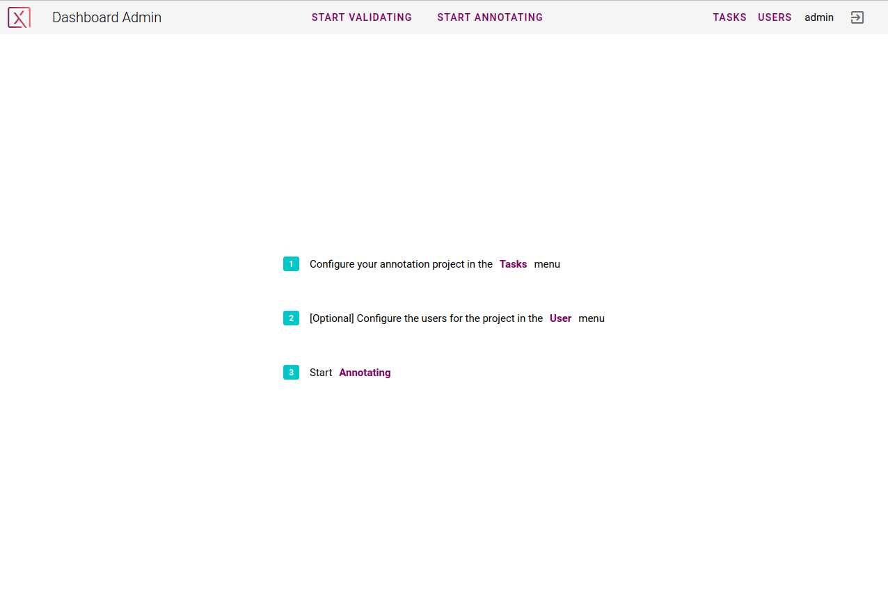
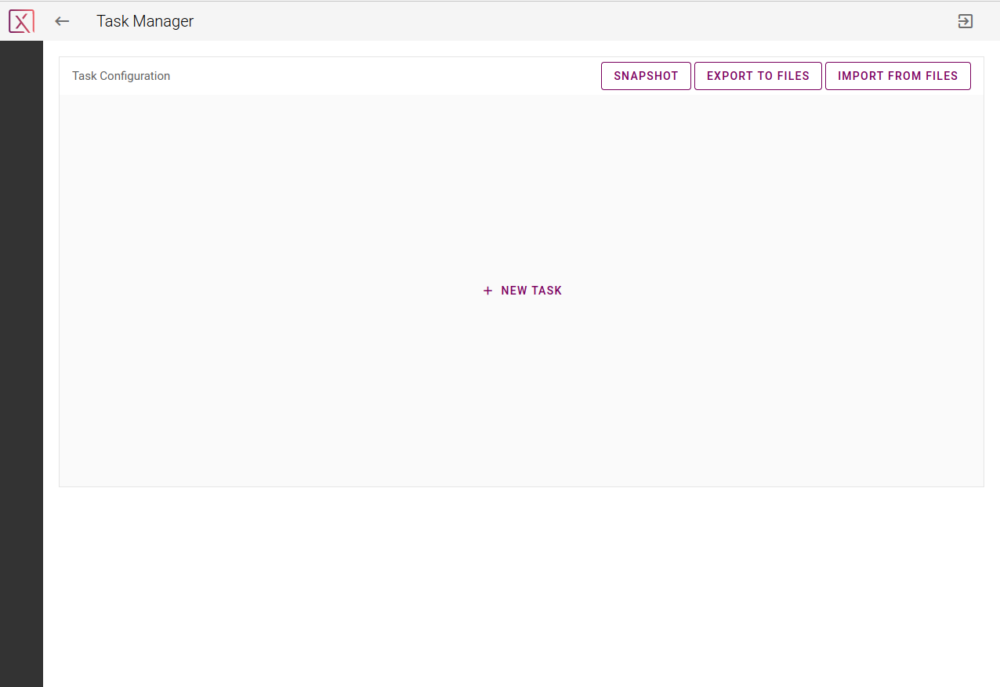
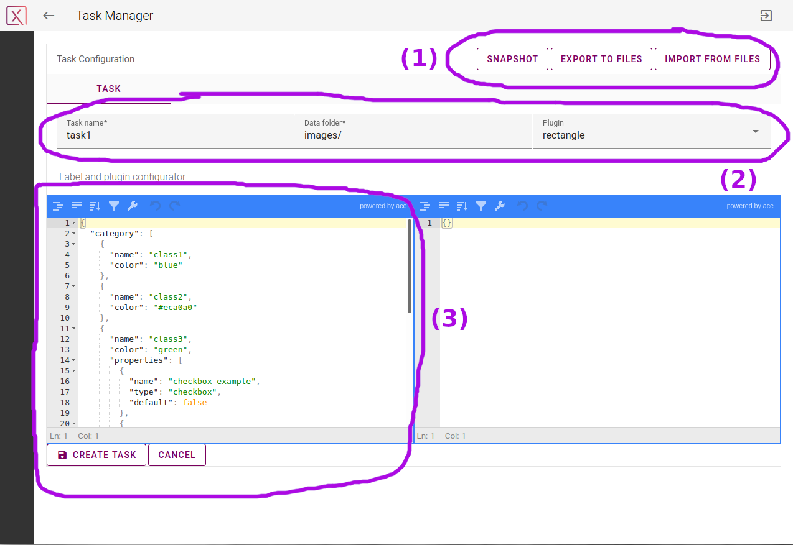
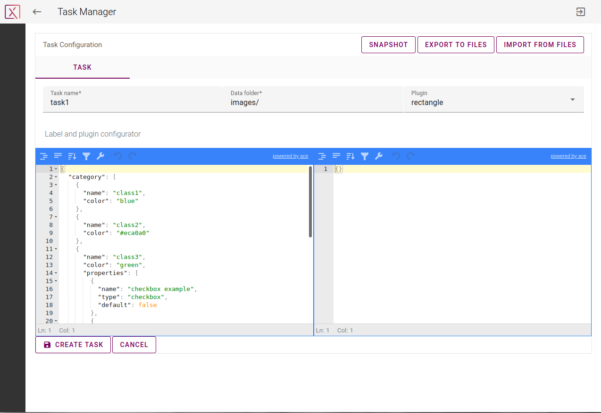
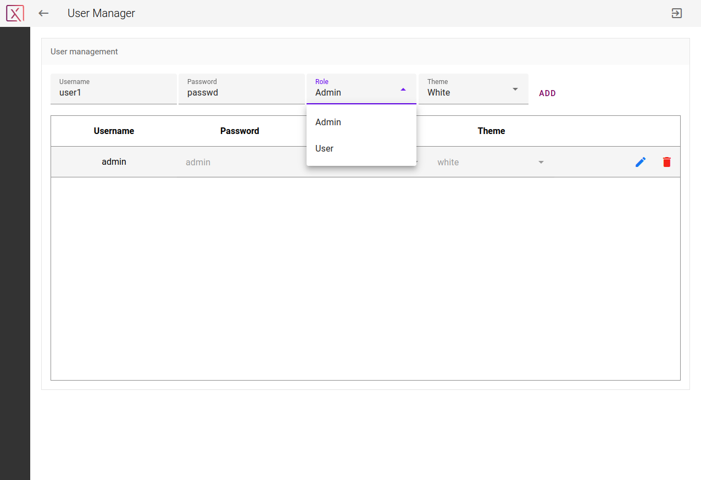
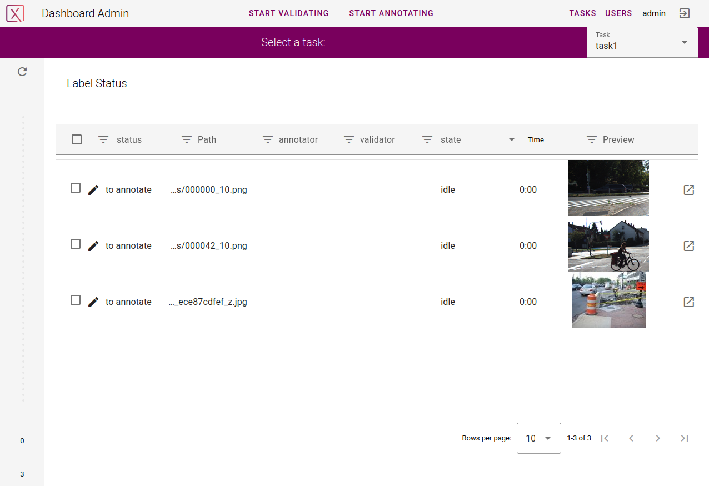

# 

A Guide for Pixano App Configuration and Administration
===============

This guide will help you to configure your annotation project.

*The screenshots on this page are all generated using the "data-test" test data set. You can get the exact same results by running Pixano-app with the following command:*

```bash
node server/server.js ./data-test
```

## Table of Contents
* [Login and first step](#login-and-first-step)
* [Create new tasks and load linked datasets](#create-new-tasks-and-load-linked-datasets)
	- [Task definition](#a-task-is-defined-by)
	- [Your datasets](#your-datasets)
	- [About data format](#about-data-format)
* [Create new users](#create-new-users)
* [Dashboard: View / Annotate / Validate](#dashboard-view-annotate-validate)

-----------------------

## Login and first step


First authentication is: `username: admin` `password: admin`.

After login in as admin, Pixano's dashboard will be displayed.



You can then create your annotation project in the [`Tasks` tab](#create-new-tasks) and update your login or create new users in the [`Users` tab](#create-new-users).

## Create new tasks and load linked datasets



Create your first task by clicking on _NEW TASK_.

<!---->


You can now fill the task configuration as follows. When clicking on _CREATE TASK_ Pixano will load all the images in the `Data folder` and create a task with the name `Task name`. For each image, an annotation job will be created and served to the annotators.

*NB: Your `images` folder refers to the folder containing the images you want to annotate by a relative path to the `workspace` folder (in this example, the workspace is ./data-test).*

You can define as many tasks as needed. They can refer to different datasets or not. For each defined task, you can:

- delete them one by one by clicking on _REMOVE TASK_
- modify their attributes and saving your changes by clicking on _SAVE TASK_

<!---->


#### A task is defined by:
- `Task name`: the name you want to give to this task
- `Data folder`: the folder containing the data to be annotated in this task (relative path to the `workspace` folder)
- `Plugin`: the plugin/functionality to be used for this task (choose it from the list). For example, if you want to annotate vehicles by rectangles, choose `rectangle`. Get more information on plugins in our [plugins' guide](./plugins-guide.md).
- Left panel: a form that gives the annotation attributes: for each class defined, you can choose a color and properties of various formats. Define as many classes you need for your task. A default form is provided that gives you all the options available for the selected plugin.
- Right panel: only used in the case of a smart plugin. Place here the path of the model to be used (or use the default model)


#### Your datasets

Each annotation task refers to a defined dataset. The same dataset can be used for multiple tasks.

A dataset is a folder containing images (directly or inside a hierarchy of folders).

For example, your `data-test` folder could have the following structure:
```
data-test   
│
└───images
    │   xxx.jpg
    │   yyy.jpg
    │
    │   ...
```

#### About data format:

- Make sure your image extensions are either `png` or `jpg`.
- Videos are not directly handled: extract the video frames beforehand. For every plugin taking a sequence as input (e.g. `sequence-rectangle`, `sequence-polygon`, `tracking`, etc), each subfolder containing images will be considered as a sequence.


## Create new users



Define your users and their role: administrator (Admin) or annotator (User); and clic on _ADD_.
<!--**TODO**Define your users and their role: _Administrator_, _Annotator_, _Validator_.-->


## Dashboard: View / Annotate / Validate

Once you defined some tasks, your dashboard will show up similar to this:



You can select a task to be or being processed (and its linked dataset to be viewed) through the drop list _Task_. You are now able to navigate in your dataset and view its images and see for each of them its status (annotated, validated, etc). The filtering bar enables you to search for a subpart of your dataset.

As an admin:

- using the _START ANNOTATING_ button, the annotation work can begin following the previously defined tasks.
- using the _START VALIDATING_ button, you will be able to validate the data that has been annotated so long.

If you defined users, these users will be able to connect to Pixano and start annotating (see our [annotator's guide](./annotator-guide.md)).
For now, only an admin is allowed to validate the annotations.

