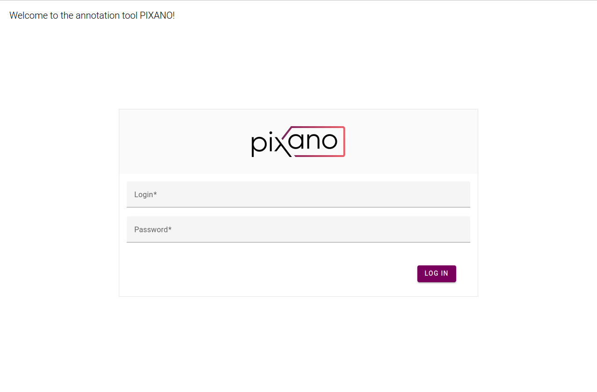
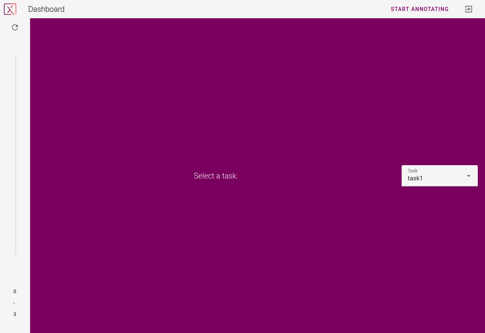
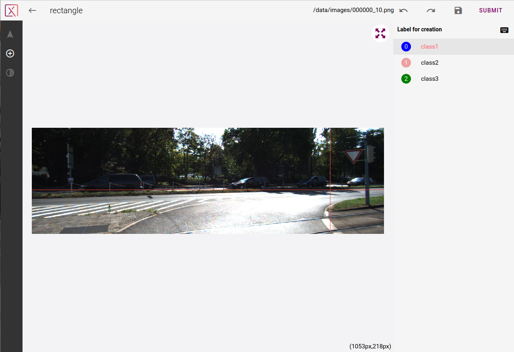
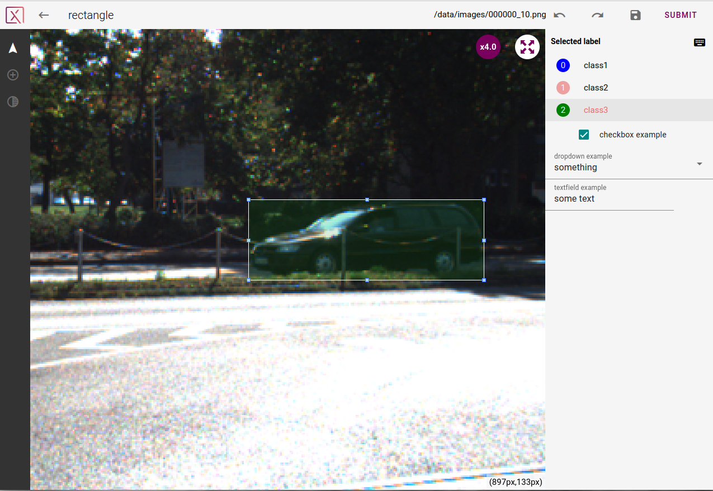

# 

A Guide for Annotators
===============

This guide will help you to start annotating.

## Table of Contents
* [Login and first step](#login-and-first-step)
* [Start annotating](#start-annotating)
	- [Task definition](#a-task-is-defined-by)
	- [Your datasets](#your-datasets)
	- [About data format](#about-data-format)
<!--* [Advices / tips & tricks](#advices-tips-tricks)-->

-----------------------

## Login and first step

Open your browser and hit `http://xxx.xxx.x.xx:3000` if Pixano is on the network or `localhost:3000` on a local server. You should see the login page of the application.

After login in with your annotator account, Pixano's annotator dashboard will be displayed.

You can now choose in the `Task` drop list the task on which you would like to start working.

## Start annotating

Jobs corresponding to the chosen task are coming one at a time, you should see something similar to this:

This view is divided into several zones:

- the left panel shows icons representing each tool you can use for the present task
- the middle panel shows the current image to annotate. Here are some actions you will be able to do in order to do and facilitate your work:
	- you can zoom in or out using the scroll of your mouse
	- the keys `m` and `p` can be used to darken or brighten the image
	- left clic to use the selected tool
	- see all available shortcuts in our [plugins' guide](./plugins-guide.md).
- the right panel shows the annotation attributes linked to your current task:
	- choose here the class of the object you want to annotate
	- fill the properties/labels if some have been defined. See an example [here](https://pixano.cea.fr/customizable-labels/).
- the upper panel gives you:
	- some information on the current job: plugin being used (in this example _rectangle_), current image.
	- the ability to revert or redo your last action
	- the save button enables you to save your current annotation without submitting it. If you go out of Pixano and come back later, you will find your work untouched
	- the _SUBMIT_ button: clic here when you think you did the work for this job. Your annotation will be saved and sent to the server for validation. Your next job will show up immediately.

<!--## Advices / tips & tricks-->
<!--**TODO** plus en profondeur pour expliquer comment bien annoter => prendre exemple sur les ghuides envoyés à Infoscribe-->

