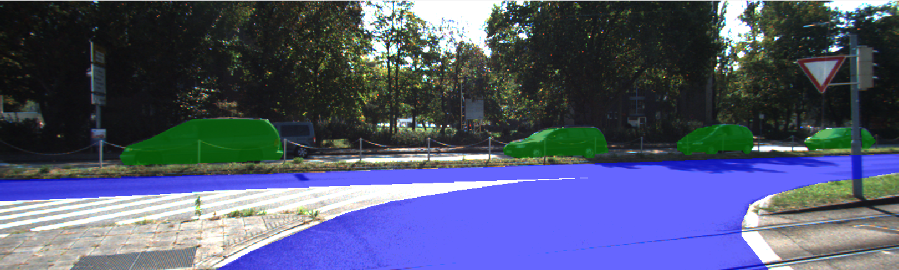
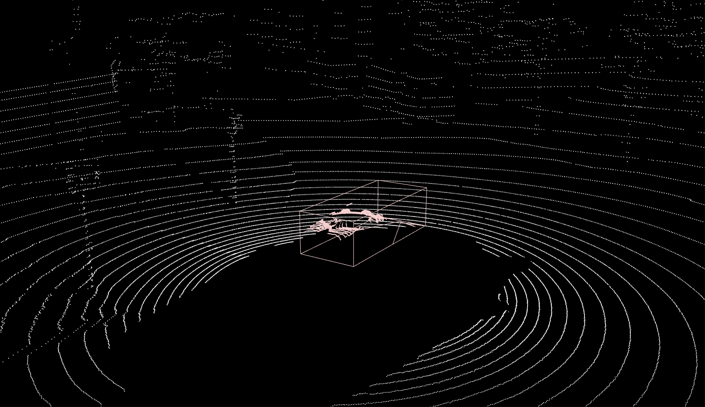

## Import existing annotations / predictions

Create an `annotation` folder as such:
```
data-test   
│
│───images
│   │    xxx.jpg
│   └─── yyy.jpg
│       
└───annotations
    │─── task1.json
    └─── task1
        │    xxx.json
        └─── yyy.json
```
The `task1.json` file contains global task settings (task type, task category, image folder, etc) and its correspoding `task1` folder contains an annotation file for each image.

### Common import information

For each task you must add a corresponding task json file with the following structure:
```json
// task1.json
{
 "name": "task1",
 "spec": {
  "plugin_name": "rectangle", // or "polygon", "segmentation", "keypoints", "cuboid", "segmentation-interactive", "smart-rectangle", etc
  "label_schema": {
   "category": [
    {
     "name": "car",
     "color": "green",
     "properties": [ // optional additional properties for given category (its color, its brand, its subtype, etc), see note below
      {
       "name": "isBlue",
       "type": "checkbox",
       "default": false
      }
     ]
    },
    {
     "name": "person",
     "color": "#eca0a0",
     "properties": [
      {
       "name": "size",
       "type": "dropdown",
       "enum": [
        "little",
        "big"
       ],
       "default": "little"
      }
     ]
    }
   ],
   "default": "person"
  }
 },
 "dataset": {
  "path": "images/", // relative path of the image folder
  "data_type": "image" // type of the data: "image" or "pcl" or "sequence_image" or "sequence_pcl"
 }
}
```

Note: for each possible object category, you can list additionnal `properties` which are either:
- `checkbox` (boolean value) : default value is `true` or `false` (make sure not to add quotation marks)
- `dropdown` type (list of choices) : default value if one of the choices.
We advise you to select default category and properties as the most frequent ones.

Note 2: When using `sequence` data type, make sure to prefix the plugin name by `sequence-` (eg. `sequence-polygon`), except for specific plugins which only work with sequences (eg. `tracking`).

Note 3: Unless specified otherwise, all 2d object coordinates are normalized by the image dimension. The object lines drawn in-between pixels, 0 corresponds to the left (or top) of the pixel 0, and 1 corresponds to the right (or bottom) of the right-most (or bottom-most) pixel.

### Import bounding box annotations / predictions


Example of annotation specification file for bounding box annotation. 

```json
// task1.json
{
 "name": "task1",
 "spec": {
  "plugin_name": "rectangle",
  "label_schema": {
   "category": [
    {
     "name": "car",
     "color": "green",
     "properties": [
      {
       "name": "isOccluded",
       "type": "checkbox",
       "default": false
      }
     ]
    },
    {
     "name": "person",
     "color": "#eca0a0",
     "properties": [
      {
       "name": "age",
       "type": "dropdown",
       "enum": [
        "child",
        "adult",
        "elderly"
       ],
       "default": "adult"
      }
     ]
    }
   ],
   "default": "person"
  }
 },
 "dataset": {
  "path": "images/",
  "data_type": "image"
 }
}
```

Example of annotation file for bounding box annotation:
```json
// xxx.json
{
 "task_name": "task1",
 "annotations": [
  {
   "id": "m83ihfsoplq",
   "geometry": {
    "vertices": [
     0.4001610305958132, // left
     0.23466666666666666, // top
     0.5048309178743962, // right
     0.6906666666666667 // bottom
    ],
    "type": "rectangle"
   },
   "category": "person",
   "options": {
    "size": "child"
   }
  }
 ],
 "data": {
  "type": "image",
  "children": "",
  "path": "images/xxx.jpg"
 }
}
```

### Import polygon annotations / predictions


Example of annotation specification file for polygon annotation. 

```json
// task1.json
{
 "name": "task2",
 "spec": {
  "plugin_name": "polygon",
  "label_schema": {
   "category": [
    {
     "name": "car",
     "color": "green",
     "properties": [
      {
       "name": "isOccluded",
       "type": "checkbox",
       "default": false
      }
     ]
    },
    {
     "name": "person",
     "color": "#eca0a0",
     "properties": [
      {
       "name": "age",
       "type": "dropdown",
       "enum": [
        "child",
        "adult",
        "elderly"
       ],
       "default": "adult"
      }
     ]
    }
   ],
   "default": "person"
  }
 },
 "dataset": {
  "path": "images/",
  "data_type": "image"
 }
}
```

Example of annotation file for polygon annotation:
```json
// xxx.json
{
 "task_name": "task2",
 "annotations": [
  {
   "id": "m83ihfsoplq",
   "geometry": {
    "vertices": [
     0.4001610305958132, // pt1 x
     0.23466666666666666, // pt1 y
     0.5048309178743962, // pt2 x
     0.6906666666666667, // pt2 y
     0.3048309178743962, // pt3 x
     0.8906666666666667 // pt3 y
    ],
    "type": "polygon"
   },
   "category": "person",
   "options": {
    "size": "child"
   }
  },
  {
   "id": "pmgfqzs2i9k0",
   "geometry": {
    "mvertices": [
     [0.5587761674718197,0.296,0.49033816425120774,0.696,0.6900161030595813,0.7973333333333333,0.715780998389694,0.36533333333333334],
     [0.2898550724637681,0.3253333333333333,0.20933977455716588,0.6186666666666667,0.3325281803542673,0.8586666666666667,0.42673107890499196,0.4053333333333333]
    ]
    "vertices":[],
    "type":"multi_polygon"
   },
   "category": "person",
   "options": {
    "size": "child"
   }
  }
 ],
 "data": {
  "type": "image",
  "children": "",
  "path": "images/xxx.jpg"
 }
}
```
Note: notice that occluded objects can be formatted as multiple associated polygons : "mvertices".


### Import keypoints annotations / predictions


Example of annotation specification file for keypoints annotation. 

```json
// task1.json
{
 "name": "task3",
 "spec": {
  "plugin_name": "keypoints",
  "label_schema": {
   "category": [
    {
     "name": "person",
     "color": "#eca0a0",
     "properties": [
      {
       "name": "age",
       "type": "dropdown",
       "enum": [
        "child",
        "adult",
        "elderly"
       ],
       "default": "adult"
      }
     ]
    }
   ],
   "default": "person"
  }
 },
 "dataset": {
  "path": "images/",
  "data_type": "image"
 }
}
```

Example of annotation file for skeleton annotation:
```json
// xxx.json
{
 "task_name": "task3",
 "annotations": [
  {
    "id":"4nuyc8i1gbs",
    "geometry":{
        "vertices":[0.7093750000000001,0.40416666666666673,0.5890625,0.17708333333333337,0.696875,0.2], // example of skeleton made of 3 points (x,y,x,y,x,y)
        "edges":[[0,1],[0,2]], // edges to be drawn between the keypoints
        "visibles":[true,true,true], // whether each keypoint is visible or not
        "type":"graph"
     },
     "category":"person",
     "options":{
        "size": "adult"
     }
   }
 ],
 "data": {
  "type": "image",
  "children": "",
  "path": "images/xxx.jpg"
 }
}
```

### Import segmentation annotation / prediction



Example of annotation specification file for panoptic segmentation annotation. 

```json
// task1.json
{
 "name": "task4",
 "spec": {
  "plugin_name": "segmentation",
  "label_schema": {
      "category": [
        {
          "name": "car",
          "color": "green",
          "idx": 1,
          "instance": true
        },
        {
          "name": "road",
          "color": "blue",
          "idx": 2,
          "instance": false
        }
      ],
      "default": "car"
    }
 },
 "dataset": {
  "path": "images/",
  "data_type": "image"
 }
}
```
Note that for each category you must specify if it is a `semantic` or `instance` category. Also note that the optional additional properties are not supported for the segmentation plugin.

Example of annotation file for segmentation annotation:
```json
// xxx.json
{
 "task_name": "task4",
 "annotations": [
  {
   "id": 0,
   "mask": "data:image/png;base64,iVBORw0KGgoAAAANSUhEUgA...ASUVORK5CYII="
  }
 ],
 "data": {
  "type": "image",
  "children": "",
  "path": "images/xxx.jpg"
 }
}
```
The segmentation mask is base64 encoded and can be read and written using the following code:
```
import json
import base64
import cv2
import numpy as np

def readb64(uri):
  encoded_data = uri.split(',')[1]
  nparr = np.fromstring(base64.b64decode(encoded_data), np.uint8)
  img = cv2.imdecode(nparr, cv2.IMREAD_UNCHANGED)
  return img

def writeb64(img):
    retval, buffer = cv2.imencode('.png', img)
    pic_str = base64.b64encode(buffer)
    pic_str = pic_str.decode()
    return pic_str

# assuming you stored the mask in a json file of the following structure
# { annotations: [{mask: "data:image/png;base64,iVBORw0KGgoAA..."}]}
with open(filename, 'r') as f:
  annotations = json.load(f)["annotations"]
for ann in annotations:
  mask = readb64(ann["mask"])
  print(mask.shape)
  # should be (height,width,3)
  # corresponding to [id1, id2, classIdx]
  # id1 and id2 are zeros in case of semantic segmentation
  # in case of instance segmentation, they should be incremental: (id1:1, id2:0), then (id1:2, id2:0), then (id1:3, id2:0), etc...
```

### Import bounding box tracking annotations / predictions

Example of annotation specification file for bounding box tracking annotation. 

```json
// task1.json
{
 "name": "task5",
 "spec": {
  "plugin_name": "tracking",
  "label_schema": {
   "category": [
    {
     "name": "car",
     "color": "green",
     "properties": [
      {
       "name": "isOccluded",
       "type": "checkbox",
       "default": false
      }
     ]
    },
    {
     "name": "person",
     "color": "#eca0a0",
     "properties": [
      {
       "name": "age",
       "type": "dropdown",
       "enum": [
        "child",
        "adult",
        "elderly"
       ],
       "default": "adult"
      }
     ]
    }
   ],
   "default": "person"
  }
 },
 "dataset": {
  "path": "images/",
  "data_type": "image"
 }
}
```

Example of annotation file for bounding box tracking annotation:
```json
// xxx.json
{
 "task_name": "task5",
 "annotations": {
  "0": {
   "id": "0",
   "keyShapes": {
    "0": {
     "geometry": {
      "vertices": [
       0.24798711755233493,
       0.3413333333333333,
       0.4500805152979066,
       0.7093333333333334
      ],
      "type": "rectangle"
     },
     "timestamp": 0,
     "labels": {}
    },
    "2": {
     "geometry": {
      "vertices": [
       0.24798711755233493,
       0.26458333333333334,
       0.8203125,
       0.7093333333333334
      ],
      "type": "rectangle"
     },
     "timestamp": 2,
     "labels": {},
     "id": "0",
     "color": "#ff1100"
    }
   },
   "category": "car",
   "labels": {}
  }
 },
 "data": {
  "type": "sequence_image",
  "children": [
   {
    "timestamp": 0,
    "path": "images/vid1/000.png"
   },
   {
    "timestamp": 1,
    "path": "images/vid1/001.png"
   },
   {
    "timestamp": 2,
    "path": "images/vid1/002.jpg"
   }
  ],
  "path": "images/vid1/"
 }
}
```

### Import cuboid annotations / predictions



Example of annotation specification file for cuboid annotation. 

```json
// task1.json
{
 "name": "task6",
 "spec": {
  "plugin_name": "cuboid",
  "label_schema": {
   "category": [
    {
     "name": "car",
     "color": "green",
     "properties": [
      {
       "name": "isOccluded",
       "type": "checkbox",
       "default": false
      }
     ]
    },
    {
     "name": "person",
     "color": "#eca0a0",
     "properties": [
      {
       "name": "age",
       "type": "dropdown",
       "enum": [
        "child",
        "adult",
        "elderly"
       ],
       "default": "adult"
      }
     ]
    }
   ],
   "default": "person"
  }
 },
 "dataset": {
  "path": "pcls/",
  "data_type": "pcl"
 }
}
```

Example of annotation file for bounding box annotation:
```json
// xxx.json
{
 "task_name": "task6",
 "annotations": [
  {
   "position": [
    0.4802595234459003, // x
    -0.06460804884089505, // y
    -0.45750510778452735 // z
   ],
   "size": [
    3.0867916079091895, // length
    1.29858273838599, // width
    0.9156043512339238 // height
   ],
   "heading": 0.03437769738776719,
   "id": "0.7u894bwwk49",
   "category": "car",
   "options": {
    "brand": "fiat"
   }
  }
 ],
 "data": {
  "type": "pcl",
  "children": "",
  "path": "pcls/xxx.bin"
 }
}
```
