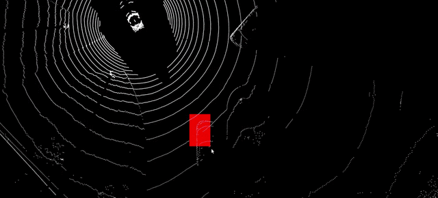
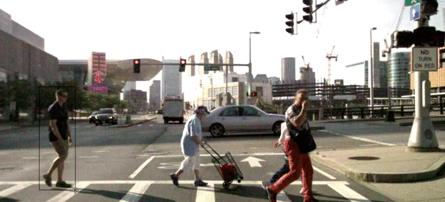

# 

<!--We use google icons in this page:-->
<link href="https://fonts.googleapis.com/icon?family=Material+Icons" rel="stylesheet">
<!--md files are "sanitized" on github => using classes from googleapis only works outside of github-->

A Guide for Pixano's plugin
===============

## List of available plugins
* 2D plugins
	* [classification](#classification)
	* [keypoints](#keypoints)
	* [rectangle](#rectangle)
	* [polygon](#polygon)
	* [segmentation](#segmentation)
* 3D plugins
	* [cuboid](#cuboid)
* [Sequences and tracking](sequences-and-tracking)
* Smart plugins
	* [smart-rectangle](#smart-rectangle)
	* [smart-segmentation](#smart-segmentation)
	* [smart-tracking](#smart-tracking)

# 2D plugins
#### Generic buttons and shortcuts (available for all 2D plugins)
| Button | Key Shortcut | Description |
|:------:|:------------:|-------------|
|  |  | `Select/Edit shape or instance` |) |  | `Select/Edit shape or instance` |
|  |  | `Create a new object` |
|  |  | `Hide/Show labels` |
|  | `Tab`        | `Loop through the scene shapes/instances` |
|  | `Escape`     | `Unselect shapes or instance` |
|  | `Delete`     | `Delete selected shapes or instance` |
|  | `m`          | `Darken   image` |
|  | `p`          | `Brighten image` |
|  | `Ctrl+C`     | `Copy in clipboard currently selected shapes/instance` |
|  | `Ctrl+V`     | `Create new shapes/instance (with new ids) from the clipboard content` |
|  | `Ctrl+Space` | `Toggle labels (hide / show)` |

## Classification
#### When should you use this plugin?
For classification purpose: each image has one or some properties you want to annotate.
<!--#### Demo / video-->
<!--A demonstration video is available for this plugin [here]().  -->
<!--An interactive demonstration is available for this plugin [here]().-->

## Keypoints
<!---->
#### When should you use this plugin?
If you need to annotate structured or articulated objects like skeletons, this plugin will enable you to:

- define the structure of the objects to annotate:
	- vertexes: for instance for a skeleton you could have a structure like: head, left hand, right hand, etc.
	- edges: the relationship between vertexes, in our skeleton example: the head is linked to the left hand and to he right hand, etc
- annotate as many instances of this object an image can contain.
#### Demo / video
<!--A demonstration video is available for this plugin [here]().  -->
An interactive demonstration is available for this plugin [here](https://pixano.cea.fr/keypoints/).
#### Specific buttons and shortcuts
| Button | Key Shortcut | Description |
|:------:|:------------:|-------------|
|  | `c` | `Swap nodes` |
|  | `h` | `AllVisible` |

## Rectangle
<!---->
#### When should you use this plugin?
This plugin is used to annotate thanks to classical bounding boxes.
#### Demo / video
<!--A demonstration video is available for this plugin [here]().  -->
An interactive demonstration is available for this plugin [here](https://pixano.cea.fr/bounding-box/).

## Polygon
<!---->
#### When should you use this plugin?
If you want to annotate objects by outlining them or by using more edges then a simple rectangle, this plugin enables you to draw polygons of as many edges as needed. If your goal is to draw outlines with pixel wise precision, have also a look at the [segmentation](#segmentation) plugin.
#### Demo / video
<!--A demonstration video is available for this plugin [here]().  -->
An interactive demonstration is available for this plugin [here](https://pixano.cea.fr/polygon/).
#### Specific buttons and shortcuts
| Button | Key Shortcut | Description |
|:------:|:------------:|-------------|
|  |  | `Group polygons` |
|  |  | `Split polygon` |
|  | | `Polyline/Polygon` |

## Segmentation
<!---->
#### When should you use this plugin?
Whatever type of segmentation you need: instance, semantic or panoptic segmentation; this plugin enables you to annotate pixel wise masks using different tools:

- the polygon tool enables you to outline objects in a classical way
- the scalable brush tool enables you to draw on the image with high precision
- you can use the Union/Subtract option to complete any selected object you draw previously
- you can sanitize your masks by filtering it i.e. removing all too small isolated blobs
- different view modes are available:
	- you can adapt the opacity of your annotation
	- you can switch between the instance (see all instances separately) and semantic (one color per class, no matter if there are more than one instances in the class) view.
#### Demo / video
<!--A demonstration video is available for this plugin [here]().  -->
An interactive demonstration is available for this plugin [here](https://pixano.cea.fr/pixelwise/).
#### Specific buttons and shortcuts
| Button | Key Shortcut | Description |
|:------:|:------------:|-------------|
|  |  | `Add instance (Brush style)` |
| ${union} | `Shift` | `Add to the selected instance` |
| ${subtract} | `Ctrl` | `Remove from the selected instance` |
|  |  | `Lock instances on click` |
|  |  | `Switch opacity` |
|  |  | `Filter isolated` |
|  |  | `Switch instance/semantic` |
| ${increase} | `+` | `Brush size increase` |
| ${decrease} | `-` | `Brush size decrease` |

# 3D plugins
## Cuboid

#### When should you use this plugin?
If your input is a point cloud, this plugin will enable you to draw cuboids around your 3D objects. During your work, you will be able to navigate inside your point cloud, to zoom in or out, and modify your cuboids as many times as needed.  
*NB: For now, only the pcl point cloud format is available.*
#### Demo / video
<!--A demonstration video is available for this plugin [here]().  -->
An interactive demonstration is available for this plugin [here](https://pixano.cea.fr/3d-bounding-box/).

#### Buttons and shortcuts
| Button | Key Shortcut | Description |
|:------:|:------------:|-------------|
|  |  | `rotate` |
|  |  | `swap` |
| ${camera} |  | `toggleView` |
|  | `n`          | `Switch to create mode` |
|  | `Escape`     | `Unselect shapes` |
|  | `Delete`     | `Delete selected shapes` |
|  | `Ctrl+C`     | `Copy in clipboard currently selected cuboid` |
|  | `Ctrl+V`     | `Create new cuboid (with new id) from the clipboard content` |
|  | `+`          | `Scale up size of points in pointcloud` |
|  | `-`          | `Scale down size of points in pointcloud` |

# Sequences and tracking
## Sequences
In Pixano, a sequence is an ordered collection of 2D or 3D images stored in a folder.   
*NB: For now, Pixano does not manage video formats. If you want to annotate a video, you should first extract its frames into a folder, and then load this folder as a sequence. Tools like ffmpeg do that very easily.*

The sequence-* plugins are extensions of 2D and 3D plugins and are available for all of them.

<!--#### Demo / video-->
<!--<!--A demonstration video is available for this plugin [here]().  -->-->
<!--An interactive demonstration is available for this plugin [here]().-->

## Tracking
#### When should you use this plugin?
Annotating image or point cloud sequences frame by frame is extremely time-consuming. Increase productivity by annotating sparingly on key frames. Extrapolate from a key frame or interpolate between two key frames. In Pixano, the tracking plugin is a special case of a sequence plugin enabling interpolation between frames to accelerate your work.
 *NB: For now, the tracking plugin is an extension of sequence-rectangle. Extending the other sequence plugins is an ongoing work.*
<!---->
<!--#### Demo / video-->
<!--<!--A demonstration video is available for this plugin [here]().  -->-->
<!--An interactive demonstration is available for this plugin [here]().-->

# Smart plugins

## Smart-rectangle

#### When should you use this plugin?
This plugin is used for the same purpose then the [rectangle](#rectangle) plugin, but offers the possibility of annotating objects in one click: adjust approximately the size of the tool to the size of the objects you want to annotate, and click on each of them.
#### Demo / video
<!--A demonstration video is available for this plugin [here]().  -->
An interactive demonstration is available for this plugin [here](https://pixano.cea.fr/smart-annotation/).
#### Specific buttons and shortcuts
| Button | Key Shortcut | Description |
|:------:|:------------:|-------------|
|  |  | `Smart mode` |
|  |  | `Split polygon` |
|  | | `Polyline/Polygon` |
| ${increase} | `+` | `ROI increase` |
| ${decrease} | `-` | `ROI decrease` |

## Smart-segmentation

#### When should you use this plugin?
This plugin is used for the same purpose then the [segmentation](#segmentation) plugin, but offers the possibility of annotating objects in one click-and-move: create a bounding box approximately around the object you want to annotate, Pixano will automatically infer a mask of this object.
#### Demo / video
<!--A demonstration video is available for this plugin [here]().  -->
An interactive demonstration is available for this plugin [here](https://pixano.cea.fr/smart-segmentation/).
#### Specific buttons and shortcuts
| Button | Shortcut | behavior |
|:------:|:------------:|-------------|
| Same | as | [segmentation](#segmentation) |
|  |  | `Smart create` |

## Smart-tracking
<!---->
#### When should you use this plugin?
This plugin is used for the same purpose then the [tracking](#tracking) plugin, but instead of interpolating between key frames, this plugin enables to track a selected object dynamically: create a clean bounding box around the object you want to annotate, press the `t` key, Pixano will automatically infer the bounding box of the next frame. If you selected _Continuous tracking_, Pixano will continue to track one frame after the other until you press `Escape`.
<!--#### Demo / video-->
<!--<!--A demonstration video is available for this plugin [here]().  -->-->
<!--An interactive demonstration is available for this plugin [here]().-->

